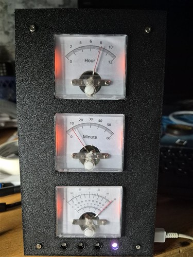

# Gauge Clock

An ESP32-based clock that displays time — and ambient conditions — on real analog voltmeter gauges.



## Overview

Three analog voltmeter gauges are driven by a 4-channel DAC to show hours, minutes, and seconds.
The lowest gauge can also be switched to show temperature, humidity, barometric pressure, or cycle
randomly through all of them, with a small WS2812 LED indicator showing which value it's currently
displaying. Ten WS2812 LEDs backlight the gauges, with a configurable color/brightness and a
vintage-lamp "flicker" effect that emulates a loose contact.

Time comes from a DS3231 RTC, kept in sync over WiFi via NTP. Ambient readings come from an AHT20
(temperature/humidity) and a BMP280 (temperature/pressure) sensor. A built-in web UI lets you
configure everything — timezone, NTP server, LED color and brightness, flicker timing, and gauge_3's
display mode — without reflashing the device.

## Features

- Analog gauge display of hours, minutes, and seconds via an MCP4728 DAC
- Selectable 4th gauge: seconds, temperature, humidity, pressure, or random cycling
- WS2812 LED backlighting with configurable color/brightness and a vintage-lamp flicker effect
- WiFi provisioning via a captive config portal (no hardcoded credentials)
- Automatic time sync over NTP, backed up to a DS3231 RTC for power-loss resilience
- Web-based configuration UI (no reflashing needed to change settings)
- All settings persisted to EEPROM

## Hardware

- ESP32 dev board
- MCP4728 4-channel DAC (drives the gauge needles)
- 3–4 analog voltmeter gauges
- DS3231 real-time clock module
- AHT20 temperature/humidity sensor
- BMP280 barometric pressure sensor
- WS2812 addressable LED strip (10 LEDs) for backlighting
- All sensors and the DAC share one I2C bus (SDA on GPIO 8, SCL on GPIO 9)

### Schematics

*Coming soon — schematics will be published on [oswh.com](https://oswh.com).*

## Dependencies

Install via the Arduino IDE Library Manager or `arduino-cli lib install`:

- `Adafruit_MCP4728`
- `Adafruit_BMP280`
- `Adafruit_AHTX0` (pulls in `Adafruit_Sensor` / `Adafruit_BusIO`)
- `DS3231` (NorthernWidget/Andrew Wickert library)
- `Adafruit_NeoPixel`
- `WiFiManager` (tzapu)
- `GyverPortal`
- `TimeLib`

`EEPROM` and `WiFiUdp` ship with the ESP32 Arduino core.

## Build & Flash

This is a standard Arduino sketch targeting the ESP32 core:

```
arduino-cli compile --fqbn esp32:esp32:esp32 Gauge-clock
arduino-cli upload -p <PORT> --fqbn esp32:esp32:esp32 Gauge-clock
```

## First boot

On first boot (or if it can't connect with saved credentials), the device starts a "GaugeClock"
WiFi access point. Connect to it and follow the captive portal to provision your WiFi network.
Once connected, the device is reachable at `gauge-clock.local` for configuration.

## License

No license specified yet.
